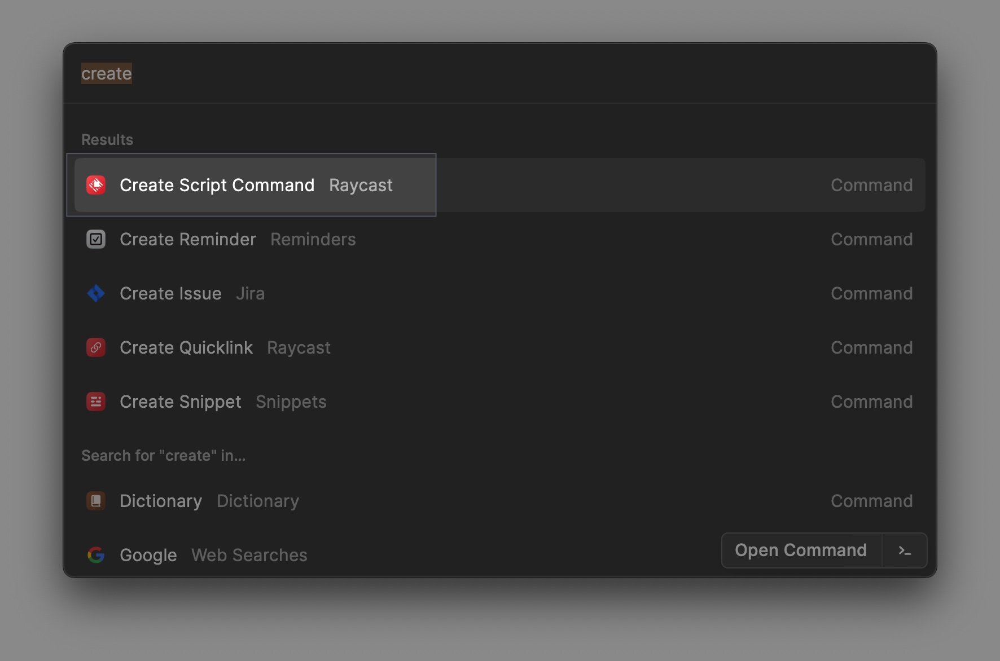
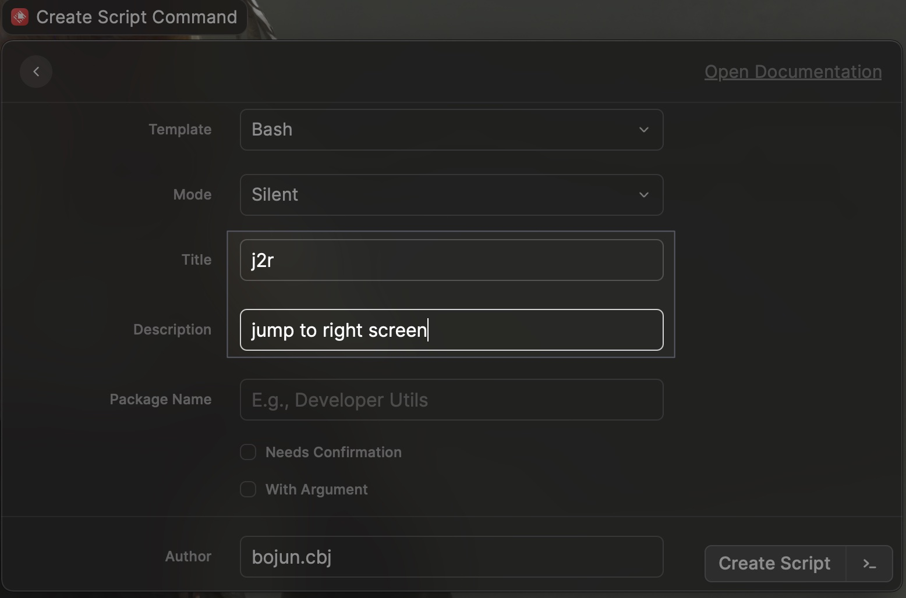
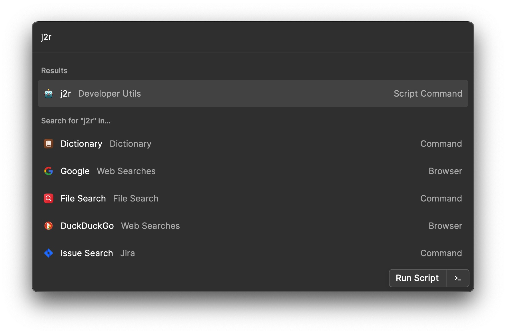

# Raycast: Switch your 🖥 🖥

> 自从用了hhkb就不爱动鼠标了，两块屏幕鼠标来回点点还是挺烦的。用`cliclick`在raycast里执行脚本还是挺方便的

## 依赖

MacOS 下安装 cliclick 非常简单，直接 homebrew 搞定。
```shell
brew install cliclick
```

找到分屏的位置，并记录下来。(我是两个两个屏幕，所有就左右就OK了)

```shell
# 鼠标分别放在左右两个屏幕，并在终端执行👇🏻这个命令获取位置
➜ ~ cliclick p
2981,295
```


记下这个坐标，后面要用！！！比如：

鼠标在左边屏幕位置为：1549,911

鼠标在右边屏幕位置为：2981,295


## raycast

raycast怎么装就不说了，安装文档和介绍[一键直达🛗](https://raycast.com)

### 步骤1：新建Raycast脚本
唤起Raycast，找到`Create Script Command`命令，回车：


按自己的信息填写信息，注意title最好搞简单点，不然不好找：


编辑已创建的脚本，例子这里是`j2r.sh`
```shell
➜ Documents bat myscript/j2r.sh
───────┬───────────────────────────────────────────────────────────────────────────────────────────────────────────
       │ File: myscript/j2r.sh
───────┼───────────────────────────────────────────────────────────────────────────────────────────────────────────
   1   │ #!/bin/bash
   2   │
   3   │ # Required parameters:
   4   │ # @raycast.schemaVersion 1
   5   │ # @raycast.title j2r
   6   │ # @raycast.mode silent
   7   │
   8   │ # Optional parameters:
   9   │ # @raycast.icon 🤖
  10   │ # @raycast.packageName Developer Utils
  11   │
  12   │ # Documentation:
  13   │ # @raycast.description jump to right screen
  14   │ # @raycast.author bojun.cbj
  15   │
  16   │ /usr/local/bin/cliclick c:2981,295
───────┴───────────────────────────────────────────────────────────────────────────────────────────────────────────
```

### 步骤2：运行脚本

快捷键唤起raycast，输入`j2r`回车即可将屏幕跳跃至右边屏幕的位置啦。



### 后期
其实一开始是打算用mac自带的workflow，但是新版的mac不知道为什么只能在自动化运行页面用快捷键唤醒。

🤔我搞明白再写下快捷方式的。